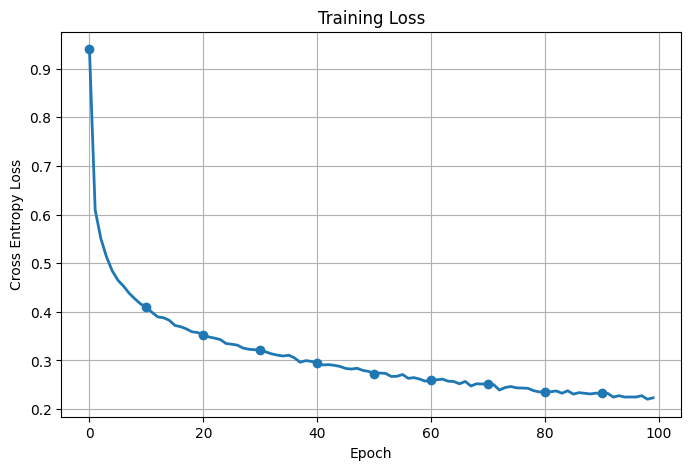
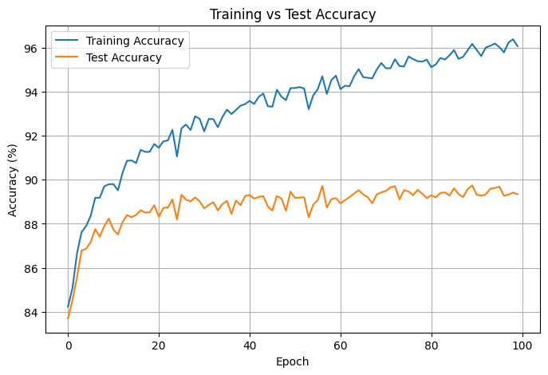
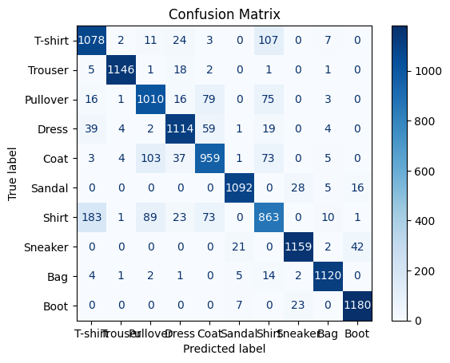

# Fashion MNIST Image Classification using PyTorch

An end-to-end Deep Learning project that classifies clothing images from the Fashion MNIST dataset using a Multi-Layer Perceptron (MLP) built from scratch in PyTorch.

The project covers the complete deep learning workflow, from data preprocessing and custom dataset creation to model training, evaluation, visualization, and performance analysis.

---

## Project Overview

Fashion MNIST is a benchmark computer vision dataset consisting of grayscale images of clothing items across 10 categories.

Each image:
- 28 × 28 grayscale pixels
- Flattened into 784 input features
- Classified into one of 10 clothing categories

The objective is to build a neural network capable of accurately classifying unseen clothing images.

---

## Dataset Classes

| Label | Class |
|--------|--------|
| 0 | T-shirt / Top |
| 1 | Trouser |
| 2 | Pullover |
| 3 | Dress |
| 4 | Coat |
| 5 | Sandal |
| 6 | Shirt |
| 7 | Sneaker |
| 8 | Bag |
| 9 | Ankle Boot |

---

## Features

- Built completely using PyTorch
- Custom Dataset and DataLoader pipeline
- Multi-Layer Perceptron (MLP)
- Batch Normalization
- Dropout Regularization
- GPU (CUDA) Support
- Mini-batch Gradient Descent
- Cross Entropy Loss
- Model Evaluation on Training & Test Sets
- Training Loss Visualization
- Accuracy Curves
- Confusion Matrix
- Classification Report
- Prediction Visualization

---

## Tech Stack

- Python
- PyTorch
- NumPy
- Pandas
- Matplotlib
- Scikit-learn

---

## Model Architecture

Input Layer (784)

↓

Linear (784 → 128)

↓

Batch Normalization

↓

ReLU

↓

Dropout (0.3)

↓

Linear (128 → 64)

↓

Batch Normalization

↓

ReLU

↓

Dropout (0.3)

↓

Linear (64 → 10)

↓

Softmax (handled internally by CrossEntropyLoss)

---

## Training Configuration

| Parameter | Value |
|-----------|-------|
| Optimizer | SGD |
| Learning Rate | 0.01 |
| Loss Function | CrossEntropyLoss |
| Batch Size | 32 |
| Epochs | 100 |
| Weight Decay | 1e-4 |

---

## Training Results

| Metric | Value |
|---------|-------|
| Training Accuracy | **93.3%** |
| Test Accuracy | **89.34%** |

The model converges smoothly during training and achieves strong generalization performance while maintaining a relatively small train-test accuracy gap.

---

## Visualizations

The notebook includes the following evaluation plots:

- Training Loss Curve
- Training vs Test Accuracy Curve
- Confusion Matrix
- Classification Report
- Correct Predictions
- Incorrect Predictions

---

## Sample Results

### Training Loss



---

### Training vs Test Accuracy



---

### Confusion Matrix



---

## Project Workflow

1. Load Fashion MNIST dataset
2. Data preprocessing and normalization
3. Create custom Dataset class
4. Build DataLoaders
5. Design MLP architecture
6. Train the neural network
7. Evaluate model performance
8. Generate visualizations
9. Analyze prediction errors

---

## Concepts Demonstrated

- Artificial Neural Networks
- Forward Propagation
- Backpropagation
- Mini-batch Gradient Descent
- Batch Normalization
- Dropout Regularization
- Cross Entropy Loss
- GPU Training using CUDA
- Model Evaluation
- Confusion Matrix Analysis
- Classification Metrics
- Data Visualization

---

## Future Improvements

- Implement Convolutional Neural Networks (CNNs)
- Hyperparameter tuning
- Learning Rate Scheduling
- Early Stopping
- Model Checkpointing
- Data Augmentation
- TensorBoard Integration
- Transfer Learning on larger image datasets

---

## Learning Outcomes

This project helped me gain practical experience with:

- Building neural networks from scratch using PyTorch
- Creating efficient data pipelines with Dataset and DataLoader
- Implementing regularization techniques
- Training models on GPU
- Evaluating classification models using multiple metrics
- Visualizing model performance
- Interpreting confusion matrices and prediction errors

---

## Repository Structure

```
fashion-mnist-pytorch-classification/
│
├── data/
├── notebook/
├── results/
├── models/
├── README.md
├── requirements.txt
└── LICENSE
```

---

## Author

**Manan Sethi**

Aspiring AI/ML Engineer passionate about Deep Learning, Computer Vision, Machine Learning, and Data Science.
